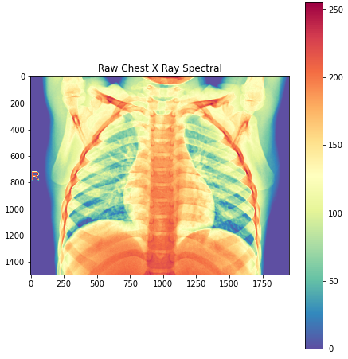

# Pediatric Chest X-ray Image Classification


## Background
In this project we will create a Machine Learning model to classify chest x-ray images as positive or negative for pneumonia.

Pneumonia is an oft misdiagnosed illness. It's symptoms mimics: upper respiratory infections, influenza, cold, pleurisy, sinus infection, and seasonal viruses. Pneumonia is a potentially life threatening condition with a mortality rate of 3.3%, and much higher when missed on the first visit. A hospital xray costs only $44 in the US health system.

Pneumonia is also overly diagnosed when other underlying causes exist. It leads to over prescribing of antibiotics, increased mortality, exposure to malpractice, and missing serious diseases such as: lung cancer, TB, pulmonary and cardiac disorders.

Proper identification of a simple chest xray could help mitigate.

The purpose of this project is to create a proof of concept model for helping identify pneumonia in pediatric patients.

## Project Structure

The Python notebook is intended to be used with Google Colab and Google Drive.  This allowed me to take advantage of storing the image dataset in Google Drive, and Google Colab's access to cloud computing and a GPU. 

The file structure within Google Drive is:
```
chest_xray  
  └───NORMAL_ALL (contains all normal imgs)
  └───PNEUMONIA_ALL (contains all pneumonia imgs)
  └───train 
  │   └───NORMAL
  │   └───PNEUMONIA
  └───test
  │   └───NORMAL
  │   └───PNEUMONIA
  └───val
      └───NORMAL
      └───PNEUMONIA
```

The project files are located on my personal Google Drive that must be shared and added to your own Google Drive to recreate the project as currently written.

## Dataset

The dataset contains over 5800 pediatric frontal chest x-rays (black and white medical quality images)

The images are labeled pneumonia 73%, and normal images 27%.

Kaggle dataset at https://www.kaggle.com/paultimothymooney/chest-xray-pneumonia

Mendely Dataset at https://data.mendeley.com/datasets/


### Images

Image Characteristics:
- 1200x1200 or larger with varying aspect ratio
- Children from infants to adolescents
- Contains both bacterial and viral pneumonia


### Downsampled Images
The original images were too large to practically be used for our model and needed to be squared.  The images were reduced to 150x150, and the RGB channels from 0->255 to 0->1.0 intensity.


## Dataset Split

For our model, we chose a split of **80/10/10** for our train/val/test split.

Since this is a relatively small dataset, we wanted to keep as many images for training as practical.  This left 585 images for testing.

## Model

A series of models were trained for accuracy in predicting the Pneumonia / Normal.

The baseline model of Dense layers performed with an accuracy ~95%

The final model was constructed with the following characteristics
- Input 150x150 image
- Three hidden layers (2DConv > MaxPooling, relu function)
- One Dropout Layer (20%)
- Flatten + one Dense layer to output


```python
# Model build
model = models.Sequential()
model.add(layers.Conv2D(32, (3, 3), activation='relu', input_shape=(150, 150, 3)))
model.add(layers.MaxPooling2D((2, 2)))

model.add(layers.Conv2D(64, (3, 3), activation='relu'))
model.add(layers.MaxPooling2D((2, 2)))

model.add(layers.Conv2D(128, (3, 3), activation='relu'))
model.add(layers.MaxPooling2D((2, 2)))
model.add(SpatialDropout2D(0.2))

model.add(layers.Conv2D(128, (3, 3), activation='relu'))
model.add(layers.MaxPooling2D((2, 2)))
model.add(SpatialDropout2D(0.2))

model.add(layers.Flatten())
model.add(layers.Dense(512, activation='relu'))
model.add(layers.Dense(1, activation='sigmoid'))
```


```python
model.compile(loss='binary_crossentropy',
              optimizer=optimizers.RMSprop(lr=1e-4),
              metrics=['acc'])
```


```python
# train model
model.fit_generator(train_generator, 
                              steps_per_epoch=100, 
                              epochs=30, 
                              validation_data=validation_generator, 
                              validation_steps=15)
```

I stopped at 30 epochs to prevent overfitting observed when I used 50.


## Model Performance
### Model accuracy: 98.3%
### Model recall: 99.1%


## Web App

To accompany the project, I made a web app. The model is live at
https://xray-pred.herokuapp.com/

Simply upload an x-ray image and receive a Normal/Pneumonia prediction.

The github repository for the Flask web app is at https://github.com/sciencelee/flask-xray2

